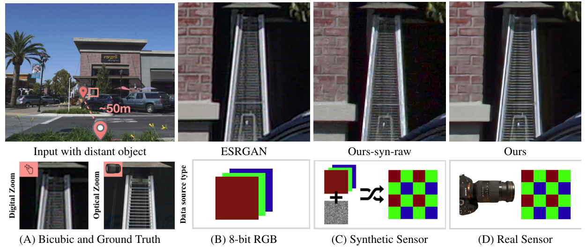

# zoom-learn-zoom
Code for CVPR 2019 paper: Zoom to Learn, Learn to Zoom

<a href="https://people.eecs.berkeley.edu/~cecilia77/project-pages/zoom.html" target="_blank">Project Website</a>  |  <a href="https://arxiv.org/pdf/1905.05169.pdf" target="_blank">Paper</a>

This paper shows that when applying machine learning to digital zoom for photography, it is beneficial to use real, RAW sensor data for training. This code is based on tensorflow (tested on V 1.13.1). It has been tested on Ubuntu 16.04 LTS.

## 


## SR-RAW Dataset

#### Use SR-RAW

SR-RAW training and testing now available <a href="https://drive.google.com/open?id=1UHKEUp77tiCZ9y05JtP6S9Tfo2RftK8m" target="_blank">here</a>.

(If you want to try out without downloading the full train/test dataset, please see the section of [quick inference](#quick-inference))

To download testing dataset (7 GB), run:
```bash
bash ./scripts/download.sh 19zlN1fqRRm7E_6i5J3B1OskJocVeuvzG test.zip
unzip test.zip
rm test.zip
```
We used 35 mm images (mostly named '00006' in the sequences) for test.

To download training dataset (58 GB), run:
```bash
bash ./scripts/download.sh 1qp6z3F4Ru9srwq1lNZr3pQ4kcVN-AOlM train.zip
unzip train.zip
rm train.zip
```

Training dataset on Baidu Drive:
@llp1996 has kindly uploaded the dataset to <a href="https://pan.baidu.com/s/1pRu7DDnpUYaPdXY8Rlb6UQ" target="_blank">Baidu Drive</a>. The key is：wi02. The original issue opened <a href="https://github.com/ceciliavision/zoom-learn-zoom/issues/8#issue-456526689"> here</a>.

#### Try with your own data

Our model is trained on raw data in <a href="http://arwviewer.com/" target="_blank">Sony Digital Camera Raw</a>. If you use other types of raw data formats, like [DNG](https://helpx.adobe.com/photoshop/digital-negative.html) used by iPhone (you can use the app [Halide](https://itunes.apple.com/us/app/halide-camera/id885697368?mt=8) to store raw from iPhone), it is necessary to fine tune the model with raw data in that format.

## Quick inference

We will download the pre-trained model and example raw data.

```bash
git clone https://github.com/ceciliavision/zoom-learn-zoom.git
cd zoom-learn-zoom
bash ./scripts/download.sh 1iForbFhhWqrq22FA1xIusfUpdi8td4Kq model.zip
unzip model.zip
bash ./scripts/download.sh 1WVSGaKIJVHwphTKhcr9ajolEnBh3aUkR quick_inference.zip
unzip quick_inference.zip
rm *.zip
python3 inference.py
```

Notes about `config/inference.yaml`
- To do inference on a folder, set `mode` to `inference` and set `inference_root` (e.g. `./quick_inference/`)
- To do inference on a single image, set `mode` to `inference_single` and set `inference_path`  (e.g. `./quick_inference/00134.ARW`)
- Set `task_folder` (e.g. `./restore_4x`)
- Results are saved in `./[task_folder]/[mode]`


## Training

#### CoBi loss
The implementation of CoBi loss presented in the paper can be found in the `./CX` directory. It's modified based on the original contextual loss <a href='https://github.com/roimehrez/contextualLoss'>implementation</a>. Refer to `./loss.py` to see how it's used. The full training pipeline is under preparation and will be released somewhere around October.

#### Data Pre-processing

We provide alignment functions and scripts to account for hand motion when capturing the dataset. This is an *optional* step, as CoBi loss does not require pixel-wise aligned data pairs for training. However, we notice that having a preliminary (imprecise) alignment step leads to faster convergence.  In summary, we provide:

- `./scripts/run_align.sh` is the script that calls `./main_crop.py`  and `./main_align_camera.py`, which first aligns field of view and then accounts for hand motion misalignment among images
- `./scripts/run_wb.sh` is the script that calls `./main_wb.py` to compute white balance applied to the processed images in the camera ISP

To run these scripts, fill in [TRAIN_PATH] with your local training data path, and [TEST_PATH] with your local test data path. If you use your own collected data for training, you either follow our data directory structure or modify these scripts.

```bash
bash ./scripts/run_align.sh [TRAIN_PATH]
bash ./scripts/run_wb.sh [TRAIN_PATH]
bash ./scripts/run_align.sh [TEST_PATH]
bash ./scripts/run_wb.sh [TEST_PATH]
```

After running these scripts, you can use the `tform.txt` and `wb.txt` inside each sequence during training. The folders called `./cropped`, `./compare` and `./aligned` are only saved for visualization.


## Citation

If you find this work useful for your research, please cite:

```
@inproceedings{zhang2019zoom
  title={Zoom to Learn, Learn to Zoom},
  author={Zhang, Xuaner and Chen, Qifeng and Ng, Ren and Koltun, Vladlen},
  booktitle={Proceedings of the IEEE Conference on Computer Vision and Pattern Recognition},
  year={2019}
}
```

## Contact
Please contact me if there is any question (Cecilia Zhang <cecilia77@berkeley.edu>).
